

  
  <h1>Synthetix</h1>
  
<strong>Football Match-Night Manager</strong>

  
A mobile-first SaaS for running weekly small-sided football nights — balanced squads generated from private fairness ratings, a live scoreboard with goals and overtime, and full group stats, in Hebrew and English.

  

    

  
  
  
  
  
  

---

## About

**Synthetix** is a web app built to replace the group-chat-and-spreadsheet chaos of
running a weekly pickup football night. It runs the whole evening — from "who's
coming?" to a saved final score — on a phone, on the pitch, in the dark.

The platform lets a group:
- Generate balanced squads from private admin ratings, without ever exposing those ratings to players
- Run a live game with a timer, goal logging, and editable overtime rules
- Rotate in a waiting squad fairly when more players show up than fit two teams
- Keep a full history of nights, personal stats, and group leaderboards
- Do all of it bilingually — Hebrew (RTL) and English, from day one

---

## How This Was Built

Built solo, **AI-first**: I orchestrate AI coding agents (Claude Code, Codex) through a documented methodology rather than writing every line by hand — the engineering discipline is the point, not the speed.

- **`AGENTS.md` as the single source of truth** — a rules file in the repo defines the architecture, conventions, and hard constraints every agent must obey: player fairness ratings never serialize into a client response, every Server Action re-checks auth and group role at the boundary, Row-Level Security enabled on every table as a second line of defense.
- **Guardrail scripts & audit pipelines** — automated checks run on every change (Server Action authorization, RLS coverage, Hebrew/English i18n parity), so quality is enforced by tooling, not vigilance.
- **The engineer decides, the agent executes** — every schema, data flow, and architectural choice on this page was designed and reviewed by me. Agents accelerate implementation; they never own the design.

The result: one engineer delivering a production system at team-level velocity — with the discipline the decisions below reflect.

---

## Features

### Match Nights
**Attendance that stays open** — Check-in stays open all night so late arrivals just join the bench, no re-doing the roster.

**Balanced squad generation** — Squads are built from private 1–5 admin ratings so teams come out even, without a spreadsheet or a group-chat argument.

**Fair waiting-squad rotation** — When attendance exceeds two teams, a waiting squad rotates in on a winner-stays basis — even partial, topped up by drag-and-drop.

**Live scoreboard** — A running timer with pause and add-a-minute, goal logging with a short undo window, and drag-and-drop squad or bench swaps that work mid-game.

**Editable overtime, mid-game** — Golden goal, timed extra time, or straight to penalties — rules can change even while the clock is running.

### Fairness, Kept Private
**Ratings never reach the browser** — Player ratings are admin-only data. Before a game starts with visibly unfair squads, the client only ever receives a boolean confirmation prompt — never the numbers behind it.

### Stats & Records
**Full history, with an editor** — Every completed night is browsable, with results that can be corrected after the fact.

**Personal and group stats** — Per-player stats and group-wide leaderboards, both derived live from the same completed-night data.

### Multi-Group SaaS
**Any group, any size** — Any signed-in user can spin up a group and invite others via a shareable link, with owner/admin/member roles controlling who manages the roster and nights.

### Experience
**Hebrew-first, RTL from day one** — Not translated after the fact — Hebrew is the default language, with English fully supported from the same dictionaries.

**Installable PWA** — A mobile-first, installable app with an offline shell, built for a phone on the sideline.

**Native app feel** — Haptic feedback on key actions, pull-to-refresh, animated page transitions, and the native share sheet — plus home-screen shortcuts that jump straight back into an open night.

---

## Screenshots

### The Match Night

|                                    Balanced Squads + Waiting Rotation                                    |                                       Live Scoreboard                                       |
| :--------------------------------------------------------------------------------------------------: | :-------------------------------------------------------------------------------------------: |
| 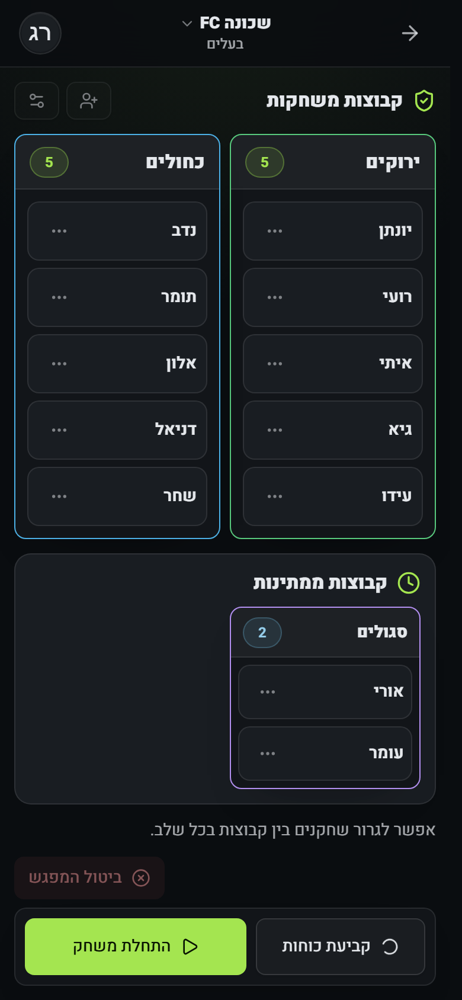 | 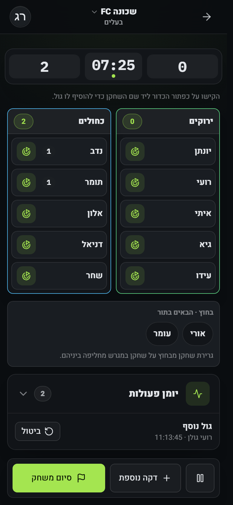 |

|                                       Overtime                                       |                                     Penalty Shootout                                     |
| :------------------------------------------------------------------------------------: | :-----------------------------------------------------------------------------------------: |
| 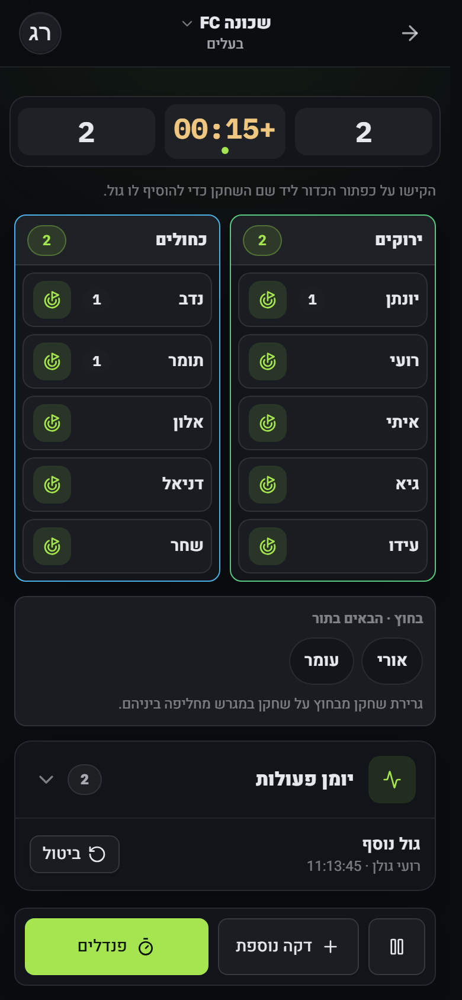 | 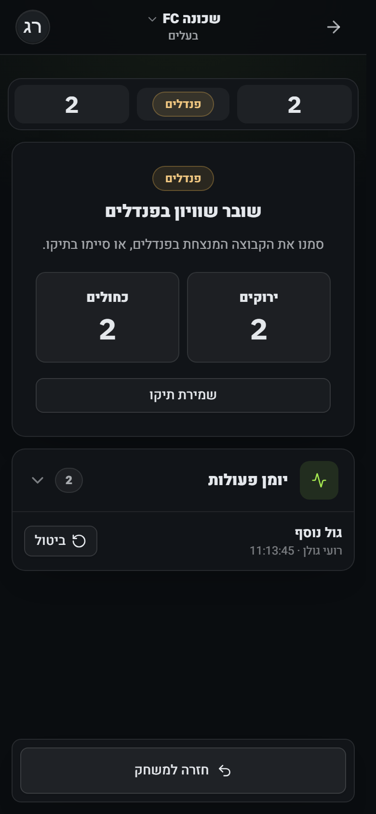 |

### Language & Theme

|                                    Hebrew — Dark                                     |                                    English — Light                                     |
| :--------------------------------------------------------------------------------------: | :----------------------------------------------------------------------------------------: |
|  | 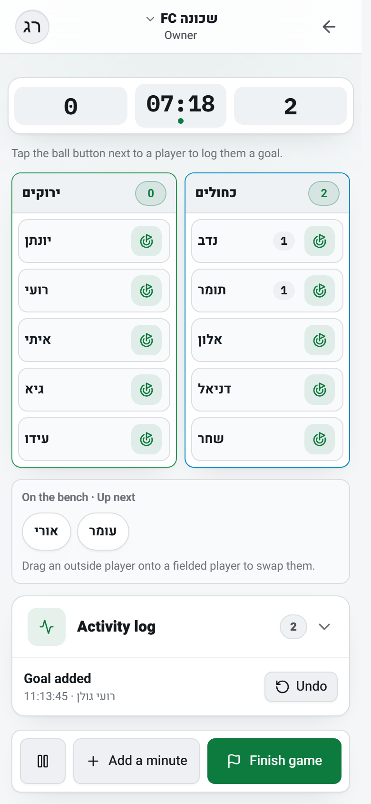 |

### Desktop

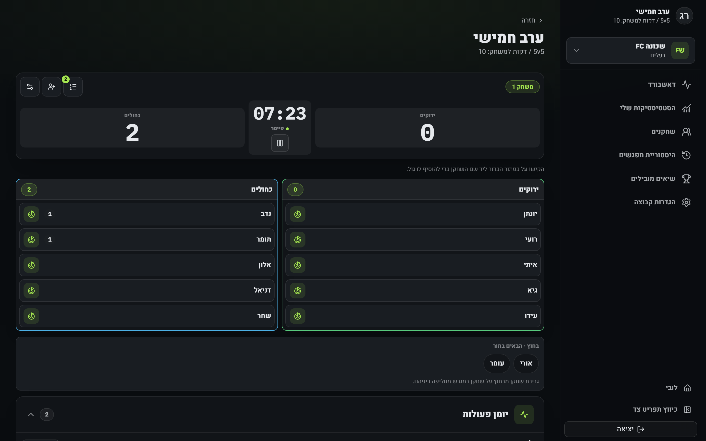

### Stats & History

**Group Dashboard**

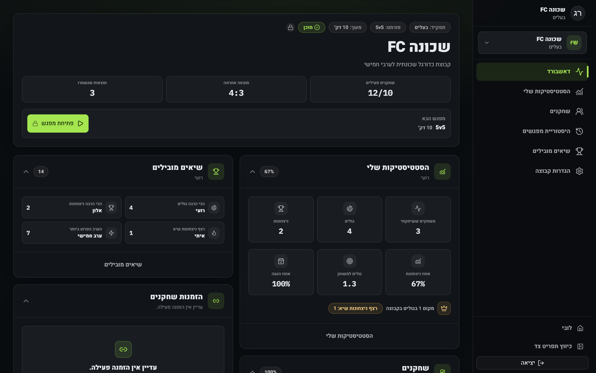

|                                  Night History                                  |                             Group Records                              |
| :---------------------------------------------------------------------------------: | :--------------------------------------------------------------------------: |
| 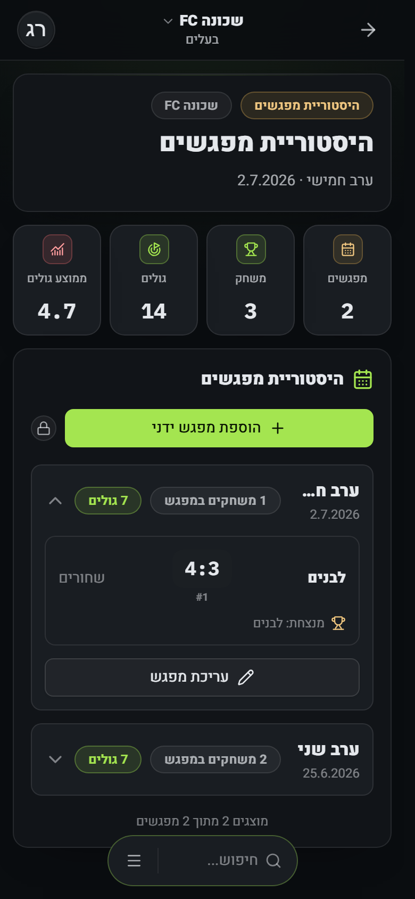 | 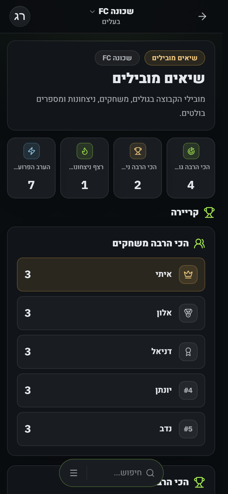 |

|                                My Stats                                |                                   Roster                                   |
| :------------------------------------------------------------------------: | :------------------------------------------------------------------------------: |
| 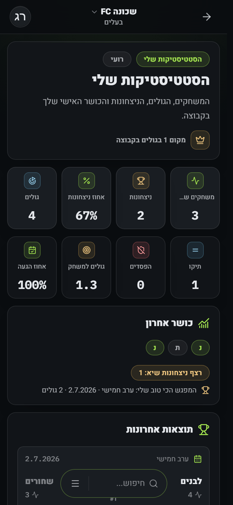 | 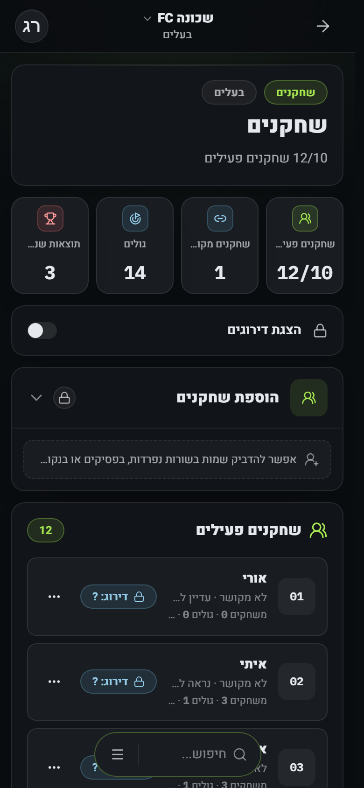 |

### Lobby

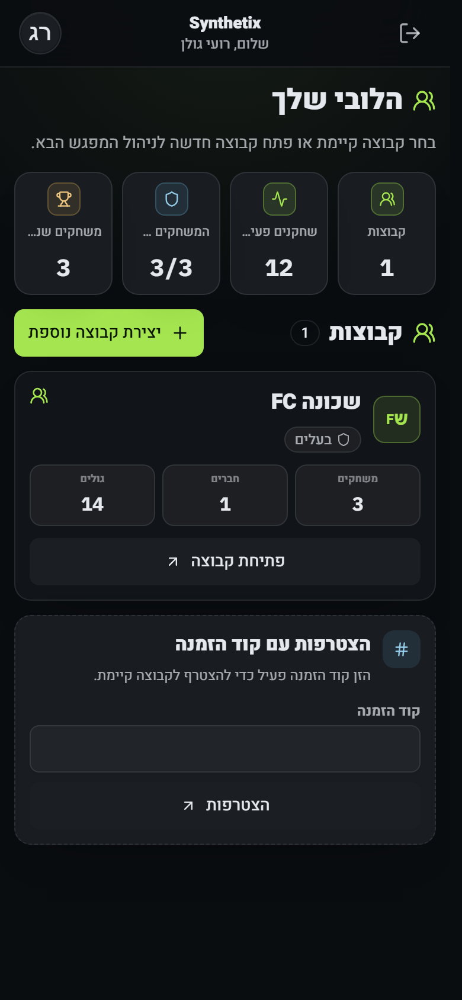

---

## Tech Stack

| Layer            | Technologies                                                        |
| :---------------- | :----------------------------------------------------------------- |
| **Framework**      | Next.js 16 (App Router), React 19, TypeScript strict                |
| **Styling**        | Tailwind CSS v4, shadcn/Radix primitives, a custom dark/light design system |
| **Database**       | Supabase (PostgreSQL) with row-level security, Drizzle ORM           |
| **Auth**           | Supabase Auth — Google OAuth, magic link, and email/password         |
| **Interactions**   | `@dnd-kit` for drag-and-drop, haptic feedback, `next-view-transitions` for page transitions |
| **i18n**           | Hand-rolled Hebrew/English dictionaries, RTL-first from the ground up |
| **PWA**            | Installable manifest with home-screen shortcuts, an offline-capable service worker, and a theme-color synced to light/dark |

---

## Architecture Highlights

### Fairness Without Exposure
Player ratings are admin-only data end to end. Fairness checks run server-side and
the client only ever receives a boolean verdict before starting a visibly unfair
game — the ratings and their totals never serialize into a client response.

### Live Night Engine
A single night's data model drives attendance, balanced squad generation, a
running game timer, goal logging with undo, and editable overtime (golden goal,
timed, or penalties) — including a winner-stays rotation that tops up a partial
waiting squad by drag-and-drop, mid-game.

### Server-Authoritative Mutations
Every mutation re-checks authentication and group role at the Server Action
boundary, not just in the UI — Server Actions are callable directly, so the
authorization has to hold regardless of how they're invoked. Row-level security
is enabled on every table as a second line of defense.

### Mobile-First PWA
Built for a phone on the sideline: an installable manifest with home-screen
shortcuts (jump straight back into an open night), an offline-capable service
worker, haptic feedback, pull-to-refresh, animated page transitions, and native
sharing — a UI designed mobile-first with desktop as a wider version of the
same workflow, not the other way around.

---

## Design System — Floodlight

Dark-first, built around a single electric-lime accent on cool near-black
neutrals — with a deep pitch-green accent on near-white neutrals in light mode.
Flat surfaces, hairline borders, no glassmorphism. The app's visual signature:
every number that changes live — the clock, the score, the stats — renders in a
monospace, tabular-numeral font, so it reads like a real scoreboard.

---

## Get Started

Want to run your own football nights? Visit [synthetix.lol](https://synthetix.lol)
to create a group and get started.

---

**Built by Sagi Menahem**

